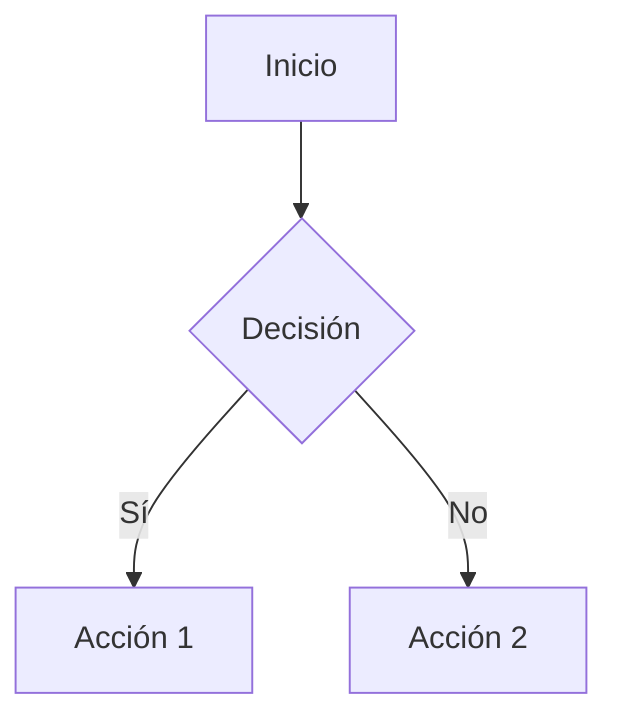
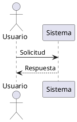

# 🚀 Getting Started - Guía Integral de Ingeniería de Software

Esta guía te ayudará a configurar y ejecutar el proyecto de documentación MkDocs en tu máquina local.

## 📋 Tabla de Contenidos

- [Requisitos Previos](#requisitos-previos)
- [Instalación](#instalación)
- [Uso](#uso)
- [Desarrollo](#desarrollo)
- [Despliegue](#despliegue)
- [Solución de Problemas](#solución-de-problemas)
- [Comandos Útiles](#comandos-útiles)

## 📦 Requisitos Previos

Antes de comenzar, asegúrate de tener instalado:

- **Python 3.8+** - [Descargar Python](https://www.python.org/downloads/)
- **pip** - Gestor de paquetes de Python (incluido con Python)
- **Git** - [Descargar Git](https://git-scm.com/downloads)

### Verificar Instalación

```bash
# Verificar Python
python --version
# Debería mostrar: Python 3.8.x o superior

# Verificar pip
pip --version
# Debería mostrar: pip 20.x.x o superior

# Verificar Git
git --version
# Debería mostrar: git version 2.x.x o superior
```

## 🔧 Instalación

### Paso 1: Clonar el Repositorio

```bash
# Clonar el repositorio
git clone <repository-url>

# Navegar al directorio del proyecto
cd mkdocs
```

### Paso 2: Crear Entorno Virtual

Es recomendable usar un entorno virtual para aislar las dependencias del proyecto.

#### En Windows:

```bash
# Crear entorno virtual
python -m venv env

# Activar entorno virtual
.\env\Scripts\activate
```

#### En Linux/Mac:

```bash
# Crear entorno virtual
python3 -m venv env

# Activar entorno virtual
source env/bin/activate
```

> 💡 **Nota**: Verás `(env)` al inicio de tu línea de comandos cuando el entorno virtual esté activado.

### Paso 3: Instalar Dependencias

```bash
# Instalar todas las dependencias desde requeriments.txt
pip install -r requeriments.txt
```

Las dependencias instaladas incluyen:

- `mkdocs==1.6.1` - Generador de sitios estáticos
- `mkdocs-material==9.7.0` - Tema Material Design
- `mkdocs_puml==2.3.0` - Soporte para PlantUML
- `mkdocs-git-revision-date-localized-plugin==1.5.0` - Fechas de revisión

### Paso 4: Verificar Instalación

```bash
# Verificar que MkDocs está instalado correctamente
mkdocs --version
# Debería mostrar: mkdocs, version 1.6.1
```

## 🎯 Uso

### Servidor de Desarrollo Local

Para ver la documentación en tu navegador con recarga automática:

```bash
# Iniciar servidor de desarrollo
mkdocs serve
```

Esto iniciará un servidor local en http://127.0.0.1:8000

> 🔥 **Hot Reload**: Los cambios que hagas en los archivos `.md` se reflejarán automáticamente en el navegador.

### Opciones del Servidor

```bash
# Servidor en un puerto diferente
mkdocs serve -a localhost:8080

# Servidor accesible desde la red local
mkdocs serve -a 0.0.0.0:8000
```

### Construir el Sitio Estático

Para generar los archivos HTML estáticos:

```bash
# Construir el sitio
mkdocs build
```

Esto creará una carpeta `site/` con todos los archivos HTML, CSS y JavaScript listos para desplegar.

### Limpiar Archivos Generados

```bash
# Limpiar la carpeta site/
mkdocs build --clean
```

## 💻 Desarrollo

### Estructura de Archivos

```
docs/
├── index.md              # Página principal
├── 00-indice.md         # Índice general
├── 01-fundamentos.md    # Sección 1
├── 02-*.md              # Más secciones
└── reports/             # Templates y ejemplos
    ├── templates/
    └── examples/
```

### Agregar Nueva Sección

1. **Crear archivo Markdown** en `docs/`:

```bash
# Crear nuevo archivo
touch docs/29-nueva-seccion.md
```

2. **Agregar contenido** siguiendo el formato existente:

```markdown
# 29 - Nueva Sección

> Descripción breve de la sección

---

## 📋 Índice Rápido

- [Tema 1](#tema-1)
- [Tema 2](#tema-2)

---

## Tema 1

Contenido aquí...

---

[⬅️ Volver al Índice](./00-indice.md)
```

3. **Actualizar el índice** en `docs/00-indice.md`:

```markdown
### 🆕 Nueva Categoría
- [29 - Nueva Sección](./29-nueva-seccion.md)
  - Descripción de contenidos
```

### Agregar Diagramas

#### Mermaid

```markdown

```

#### PlantUML

```markdown

```

### Personalizar Configuración

Edita `mkdocs.yml` para personalizar:

```yaml
site_name: Tu Nombre del Sitio
theme:
  name: material
  palette:
    - scheme: default
      primary: indigo
      accent: indigo
```

## 🚀 Despliegue

### GitHub Pages

```bash
# Desplegar a GitHub Pages
mkdocs gh-deploy
```

Este comando:
1. Construye el sitio
2. Crea/actualiza la rama `gh-pages`
3. Pushea los cambios a GitHub

### Netlify

1. Conecta tu repositorio a Netlify
2. Configura el build:
   - **Build command**: `mkdocs build`
   - **Publish directory**: `site`

### Vercel

1. Importa tu repositorio en Vercel
2. Configura:
   - **Build Command**: `mkdocs build`
   - **Output Directory**: `site`

### Docker

Crea un `Dockerfile`:

```dockerfile
FROM python:3.11-slim

WORKDIR /docs

COPY requeriments.txt .
RUN pip install --no-cache-dir -r requeriments.txt

COPY . .

EXPOSE 8000

CMD ["mkdocs", "serve", "-a", "0.0.0.0:8000"]
```

Construir y ejecutar:

```bash
# Construir imagen
docker build -t mkdocs-guide .

# Ejecutar contenedor
docker run -p 8000:8000 mkdocs-guide
```

## 🔍 Solución de Problemas

### Error: `mkdocs: command not found`

**Solución**: Asegúrate de que el entorno virtual está activado:

```bash
# Windows
.\env\Scripts\activate

# Linux/Mac
source env/bin/activate
```

### Error: `ModuleNotFoundError: No module named 'mkdocs'`

**Solución**: Reinstala las dependencias:

```bash
pip install -r requeriments.txt
```

### Error: PlantUML no renderiza

**Solución**: Verifica la conexión a internet, ya que PlantUML usa un servidor remoto:

```yaml
plugins:
  - plantuml:
      puml_url: https://www.plantuml.com/plantuml/
```

### El servidor no recarga automáticamente

**Solución**: 
1. Detén el servidor (Ctrl+C)
2. Limpia la caché: `mkdocs build --clean`
3. Reinicia: `mkdocs serve`

### Problemas con Python en Windows

**Solución**: Usa `py` en lugar de `python`:

```bash
py -m venv env
py -m pip install -r requeriments.txt
```

## 📝 Comandos Útiles

### Comandos MkDocs

```bash
# Ver ayuda
mkdocs --help

# Ver versión
mkdocs --version

# Servir con modo verbose
mkdocs serve --verbose

# Construir sin limpiar
mkdocs build

# Construir y limpiar archivos antiguos
mkdocs build --clean

# Validar configuración
mkdocs build --strict
```

### Comandos Python/Pip

```bash
# Listar paquetes instalados
pip list

# Actualizar pip
python -m pip install --upgrade pip

# Congelar dependencias actuales
pip freeze > requeriments.txt

# Desactivar entorno virtual
deactivate
```

### Comandos Git

```bash
# Ver estado
git status

# Agregar cambios
git add .

# Commit
git commit -m "docs: actualizar sección X"

# Push
git push origin main

# Pull últimos cambios
git pull origin main
```

## 🎨 Personalización Avanzada

### Cambiar Tema de Colores

Edita `mkdocs.yml`:

```yaml
theme:
  palette:
    # Modo claro
    - media: "(prefers-color-scheme: light)"
      scheme: default
      primary: blue
      accent: blue
      toggle:
        icon: material/brightness-7
        name: Cambiar a modo oscuro
    
    # Modo oscuro
    - media: "(prefers-color-scheme: dark)"
      scheme: slate
      primary: indigo
      accent: indigo
      toggle:
        icon: material/brightness-4
        name: Cambiar a modo claro
```

### Agregar Extensiones de Markdown

```yaml
markdown_extensions:
  - admonition
  - codehilite
  - footnotes
  - meta
  - toc:
      permalink: true
  - pymdownx.arithmatex
  - pymdownx.betterem
  - pymdownx.caret
  - pymdownx.critic
  - pymdownx.details
  - pymdownx.emoji
  - pymdownx.highlight
  - pymdownx.inlinehilite
  - pymdownx.keys
  - pymdownx.mark
  - pymdownx.smartsymbols
  - pymdownx.superfences
  - pymdownx.tabbed
  - pymdownx.tasklist
  - pymdownx.tilde
```

### Agregar Google Analytics

```yaml
extra:
  analytics:
    provider: google
    property: G-XXXXXXXXXX
```

## 📚 Recursos Adicionales

- [Documentación oficial de MkDocs](https://www.mkdocs.org/)
- [Material for MkDocs](https://squidfunk.github.io/mkdocs-material/)
- [Guía de Markdown](https://www.markdownguide.org/)
- [Mermaid Documentation](https://mermaid.js.org/)
- [PlantUML Guide](https://plantuml.com/guide)

## 🤝 Soporte

Si encuentras problemas o tienes preguntas:

1. Revisa la [documentación oficial](https://www.mkdocs.org/)
2. Busca en [GitHub Issues](https://github.com/mkdocs/mkdocs/issues)
3. Contacta al mantenedor: [@davichuder](https://github.com/davichuder)

---

> 💡 **Tip**: Mantén tu entorno virtual activado mientras trabajas en el proyecto para evitar conflictos de dependencias.

**¡Feliz documentación!** 📝✨
