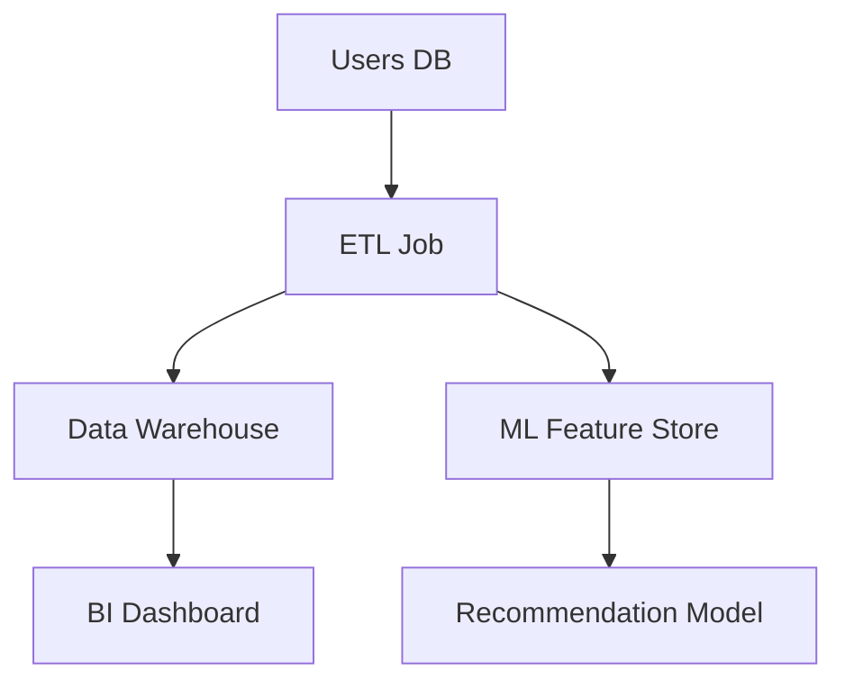

# 22 - Data Governance

> Gestión de disponibilidad, usabilidad, integridad y seguridad de datos empresariales.

[🏠 Volver al índice](./00-indice.md)

---

## 📋 Índice Rápido

- [🎯 Data Governance](#data-governance)
- [📊 Pilares de Data Governance](#pilares-de-data-governance)
- [📋 Data Quality Framework](#data-quality-framework)
- [🔍 Data Lineage](#data-lineage)
- [📚 Data Catalog](#data-catalog)
- [🔐 Data Security & Privacy](#data-security-privacy)
- [🗄️ Master Data Management (MDM)](#master-data-management-mdm)
- [📊 Data Quality Monitoring](#data-quality-monitoring)
- [🔄 Data Lifecycle Management](#data-lifecycle-management)
- [📋 Data Governance Roles](#data-governance-roles)
- [🚫 Anti-patrones](#anti-patrones)
- [📚 Recursos](#recursos)

---

## 🎯 Data Governance

**Qué:** Framework de políticas, procesos y controles para gestionar datos como activo estratégico.

**Por qué:** Datos son el nuevo petróleo. Sin governance = caos, riesgos legales, decisiones incorrectas.

**Quién:** Chief Data Officer, Data Stewards, compliance, engineering.

**Cuándo:** Desde día 1 manejando datos sensibles o a escala.

**Esfuerzo:** Inversión inicial alta, previene multas millonarias (GDPR hasta €20M).

---

## 📊 Pilares de Data Governance

| Pilar | Qué | Cómo implementar |
|:------|:-----|:-----------------|
| **Data Quality** | Datos precisos, completos, consistentes | Validaciones, monitoreo, data contracts |
| **Data Security** | Proteger de accesos no autorizados | Encryption, access control, auditoría |
| **Data Privacy** | Cumplir regulaciones (GDPR, CCPA) | Minimización, consentimiento, right to delete |
| **Data Lineage** | Rastrear origen y transformaciones | Metadata management, cataloging |
| **Master Data Management** | Single source of truth | Golden records, deduplicación |

---

## 📋 Data Quality Framework

### Dimensiones de Calidad

| Dimensión | Qué | Validación |
|:----------|:-----|:-----------|
| **Accuracy** | Datos reflejan realidad | Comparar con fuentes autoritativas |
| **Completeness** | Sin valores faltantes críticos | % campos poblados |
| **Consistency** | Misma info en múltiples lugares coincide | Cross-system checks |
| **Timeliness** | Datos actualizados | Timestamp freshness |
| **Validity** | Cumple reglas de negocio | Regex, ranges, foreign keys |
| **Uniqueness** | Sin duplicados | Deduplicación, composite keys |

### Data Contracts

**Qué:** Acuerdo explícito entre producer y consumer sobre schema y calidad de datos.

**Ejemplo:**

```yaml
# user_events.contract.yml
dataset: user_events
owner: analytics-team
schema:
  - name: user_id
    type: string
    required: true
    format: uuid
  - name: event_type
    type: enum
    values: [signup, login, purchase]
  - name: timestamp
    type: datetime
    required: true
sla:
  freshness: 5 minutes
  completeness: 99%
```

**Enforcement:** Pipeline rechaza datos que violan contrato.

**Herramientas:** [Great Expectations](https://greatexpectations.io/), [Soda](https://www.soda.io/), [Monte Carlo](https://www.montecarlodata.com/)

---

## 🔍 Data Lineage

**Qué:** Mapa visual de origen, transformaciones y destino de datos.

**Por qué:** Debugging, impact analysis, compliance.

**Cuándo:** Sistemas complejos con múltiples transformaciones.

**Ejemplo de Lineage:**



**Preguntas que responde:**

- ¿De dónde vienen estos datos?
- ¿Qué sistemas usan esta tabla?
- Si cambio schema aquí, ¿qué se rompe?
- ¿Por qué este reporte muestra X?

**Niveles:**

- **Column-level:** Trazabilidad campo por campo
- **Table-level:** Dependencias entre tablas
- **System-level:** Flujo entre sistemas

**Herramientas:** [Apache Atlas](https://atlas.apache.org/), [Amundsen](https://www.amundsen.io/), [DataHub](https://datahubproject.io/)

---

## 📚 Data Catalog

**Qué:** Inventario searchable de todos los datasets de la organización.

**Por qué:** Descubrimiento, evitar duplicados, democratizar acceso.

**Cuándo:** >50 datasets o múltiples fuentes.

**Metadata incluida:**

| Tipo | Ejemplos |
|:-----|:---------|
| **Technical** | Schema, size, format, location |
| **Business** | Descripción, owner, use cases |
| **Operational** | Freshness, update frequency, SLA |
| **Social** | Ratings, comments, popularidad |

**Ejemplo Entry:**

```yaml
Dataset: customer_transactions
Description: Todas las transacciones de clientes desde 2020
Owner: finance-team
Schema: 
  - transaction_id (UUID, PK)
  - user_id (UUID, FK → users)
  - amount (DECIMAL)
  - timestamp (DATETIME)
Freshness: Real-time (< 1 min)
Access: Restricted (PII)
Tags: #financial #pii #production
Related: customer_profiles, product_catalog
```

**Herramientas:** [Alation](https://www.alation.com/), [Collibra](https://www.collibra.com/), [Atlan](https://atlan.com/)

---

## 🔐 Data Security & Privacy

### Access Control

| Nivel | Qué | Implementación |
|:------|:-----|:---------------|
| **Row-level** | Filtrar filas según usuario | `WHERE user_region = current_user_region` |
| **Column-level** | Ocultar columnas sensibles | Views sin PII, field-level encryption |
| **Dataset-level** | Acceso por roles | RBAC, grupos IAM |

### Privacy by Design

**Principios:**

1. **Data Minimization:** Solo recopilar lo necesario
2. **Purpose Limitation:** Usar solo para fin declarado
3. **Consent Management:** Opt-in explícito
4. **Right to Access:** Usuario puede ver sus datos
5. **Right to Delete:** Usuario puede borrar sus datos
6. **Pseudonymization:** Reemplazar identificadores directos
7. **Encryption:** En tránsito y reposo

### PII (Personally Identifiable Information)

**Tipos:**

| Tipo | Ejemplos | Protección |
|:-----|:---------|:-----------|
| **Direct PII** | Email, teléfono, SSN | Hash, encrypt, access control |
| **Indirect PII** | IP, device ID, location | Aggregate, anonymize |
| **Sensitive PII** | Salud, religión, etnia | Extra protección, explicit consent |

**Techniques:**

| Técnica | Qué | Cuándo |
|:--------|:-----|:-------|
| **Hashing** | One-way transformation | Passwords, identificadores |
| **Tokenization** | Reemplazar con token | Credit cards, referencias |
| **Masking** | Ocultar parcialmente | Logs, UIs (`***-**-1234`) |
| **Anonymization** | Eliminar identificadores | Analytics, research |
| **Differential Privacy** | Ruido matemático | Statistical releases |

---

## 🗄️ Master Data Management (MDM)

**Qué:** Proceso para crear "golden record" único y autoritativo de entidades críticas.

**Por qué:** Sin MDM = 10 sistemas con 10 versiones de "Cliente A".

**Cuándo:** Múltiples sistemas con datos duplicados/conflictivos.

**Entidades típicas:**

- **Clientes:** Deduplicar, consolidar info de CRM, Support, Sales
- **Productos:** SKU único, jerarquía consistente
- **Empleados:** HR system como source of truth
- **Proveedores:** Vendor master data

**Proceso:**

```text
Fuente 1: Cliente "John Smith", email: john@email.com
Fuente 2: Cliente "J. Smith", phone: 555-1234
Fuente 3: Cliente "Smith, John", address: 123 Main St

↓ [MDM Process: Match, Merge, Survive]

Golden Record:
  Name: John Smith
  Email: john@email.com
  Phone: 555-1234
  Address: 123 Main St
  Master_ID: CUST-0001
```

**Herramientas:** [Informatica MDM](https://www.informatica.com/products/master-data-management.html), [Talend MDM](https://www.talend.com/products/mdm/), [Profisee](https://profisee.com/)

---

## 📊 Data Quality Monitoring

### Observability para Datos

**Métricas:**

| Métrica | Qué | Alert |
|:--------|:-----|:------|
| **Freshness** | Última actualización | >2h sin actualizar |
| **Volume** | Cantidad de registros | Spike o drop >20% |
| **Schema Changes** | Cambios no esperados | Columna nueva/borrada |
| **Null Rate** | % valores nulos | >5% en campo critical |
| **Duplicate Rate** | % registros duplicados | >1% |
| **Distribution Shift** | Cambio en distribución | KS-test p-value < 0.05 |

### Anomaly Detection

```python
# Ejemplo: Detectar anomalías en volumen diario
import pandas as pd

daily_counts = df.groupby('date').size()
mean = daily_counts.mean()
std = daily_counts.std()

# Alert si >3 std deviations
threshold = mean + 3 * std
anomalies = daily_counts[daily_counts > threshold]
```

**Herramientas:** [Monte Carlo Data](https://www.montecarlodata.com/), [Bigeye](https://www.bigeye.com/), [Datafold](https://www.datafold.com/)

---

## 🔄 Data Lifecycle Management

| Fase | Qué | Políticas |
|:-----|:-----|:----------|
| **Creation** | Ingesta inicial | Validación, classification |
| **Storage** | Almacenamiento | Encryption, backup |
| **Usage** | Consumo | Access control, auditoría |
| **Archival** | Mover a storage barato | Retention policy (7 años) |
| **Deletion** | Eliminación segura | Compliance, purge |

**Retention Policy Ejemplo:**

```yaml
Transaction Records:
  - Active: 2 años (hot storage)
  - Archive: 5 años (cold storage)
  - Delete: Después 7 años
  - Exception: Legal hold suspende deletion
```

---

## 📋 Data Governance Roles

| Rol | Responsabilidad |
|:----|:----------------|
| **Chief Data Officer** | Estrategia, budget, accountability |
| **Data Steward** | Calidad, metadata, access control |
| **Data Owner** | Responsable final de dataset |
| **Data Custodian** | Mantiene infraestructura |
| **Data User** | Consume datos, reporta issues |

---

## 🚫 Anti-patrones

| Anti-patrón | Problema | Solución |
|:------------|:---------|:---------|
| **Data swamp** | Data lake sin governance | Cataloging, quality checks |
| **Siloed data** | Equipos con copias propias | MDM, centralized catalog |
| **No documentation** | Nadie sabe qué es cada campo | Data dictionary obligatorio |
| **Manual processes** | Humans haciendo validación | Automated data quality checks |
| **Reactive governance** | Actuar solo tras problemas | Proactive monitoring, policies |

---

## 📚 Recursos

- [DAMA-DMBOK](https://www.dama.org/cpages/body-of-knowledge) - Data Management Body of Knowledge
- [GDPR Compliance Guide](https://gdpr.eu/)
- [Data Governance Institute](https://datagovernance.com/)
- [Great Expectations Documentation](https://docs.greatexpectations.io/)

---

[⬅️ Anterior: Ciencia de Datos](./21-ciencia-datos.md) | [⬆️ Volver arriba](#22-data-governance) | [➡️ Siguiente: Análisis Estratégico](./23-analisis-estrategico.md)
