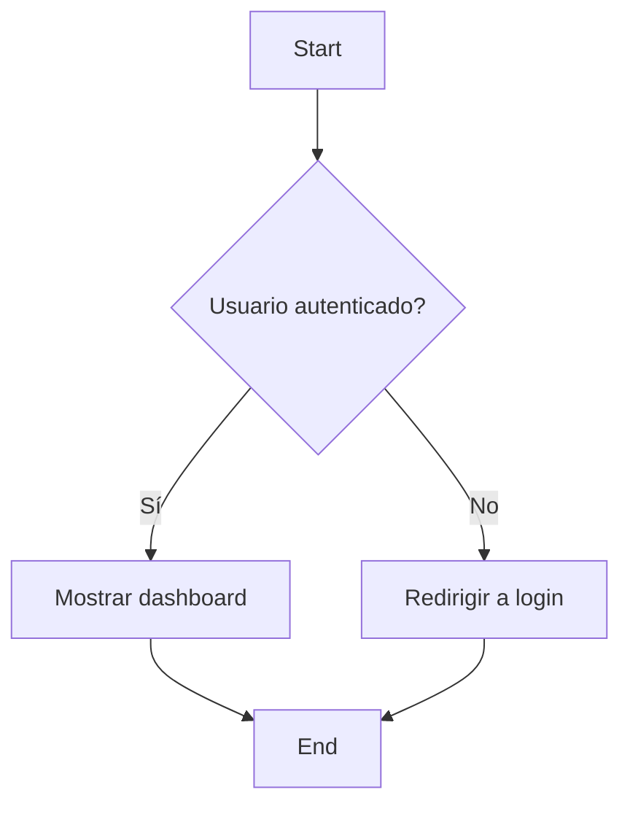
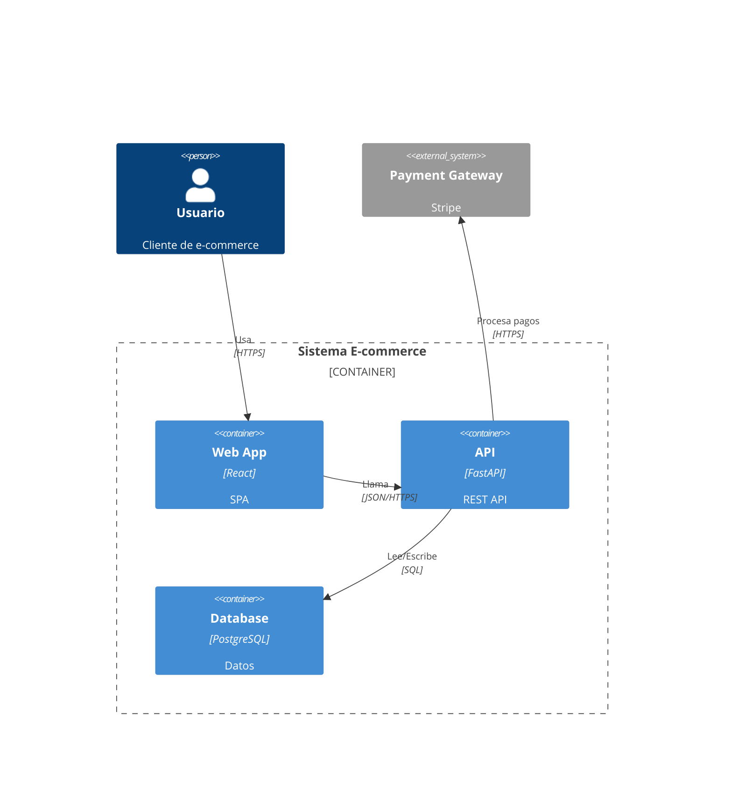
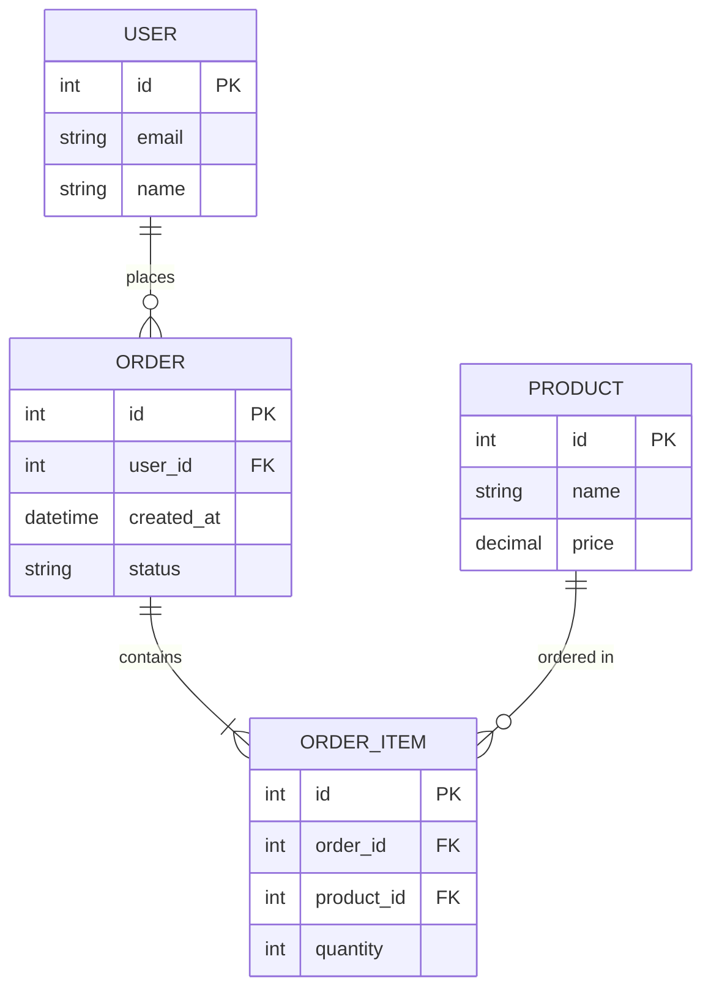
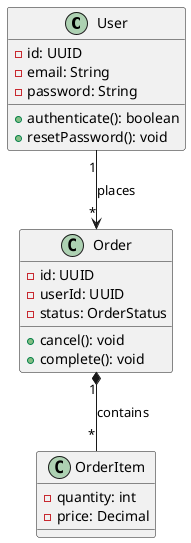
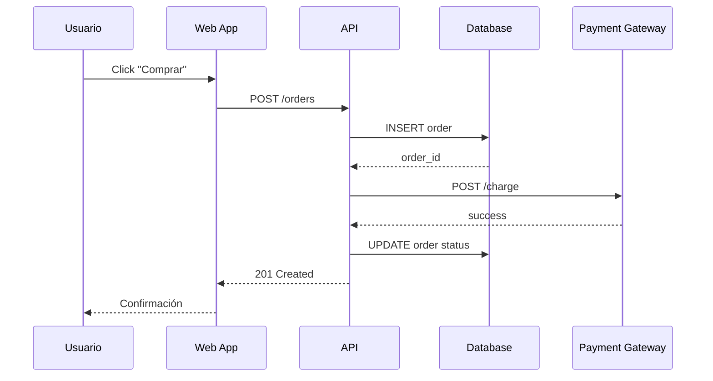
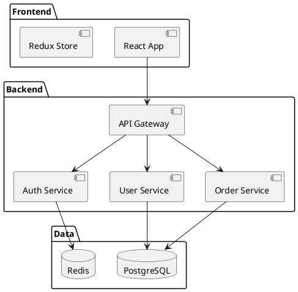
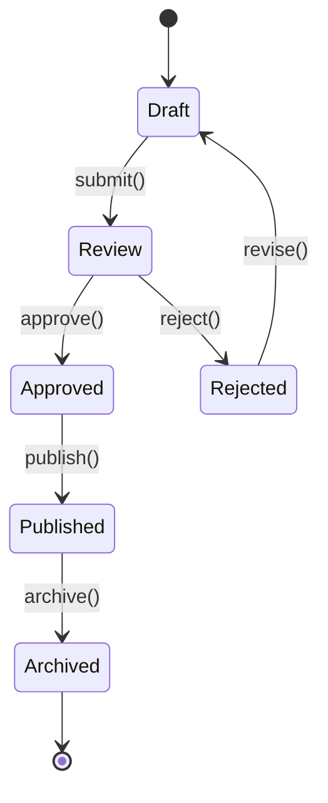
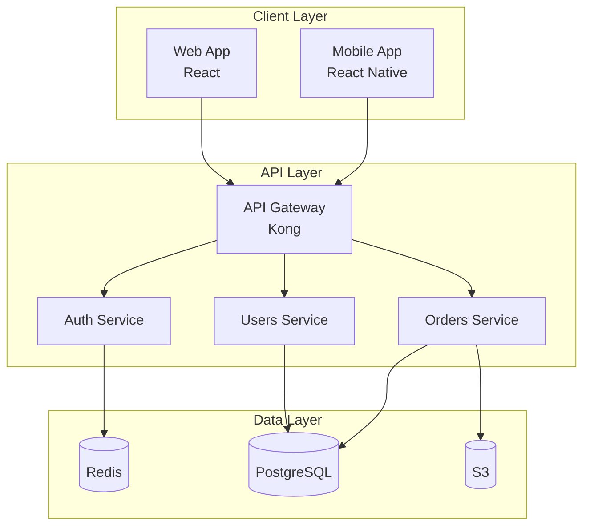
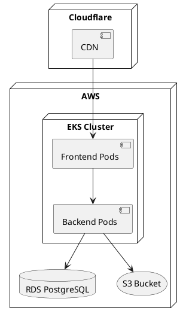

# 28 - Documentación y Diagramas

> Lenguajes, herramientas y tipos de diagramas para documentar sistemas de software efectivamente.

[🏠 Volver al índice](./00-indice.md)

---

## 📋 Índice Rápido

- [📝 Documentación de Software](#documentacion-de-software)
- [📖 Lenguajes de Documentación](#lenguajes-de-documentacion)
- [🎨 Herramientas de Diagramas](#herramientas-de-diagramas)
- [📊 Tipos de Diagramas](#tipos-de-diagramas)
- [📚 Tipos de Documentación](#tipos-de-documentacion)
- [✍️ Best Practices Documentación](#best-practices-documentacion)
- [🚫 Anti-patrones](#anti-patrones)
- [📚 Recursos](#recursos)
---

## 📝 Documentación de Software

**What:** Información escrita o visual que explica cómo funciona, se usa o se mantiene un sistema.

**Why:** Código se lee 10x más de lo que se escribe. Buena doc = onboarding rápido, menos bugs, mejor mantenimiento.

**Who:** Developers, technical writers, architects.

**When:** Continuo, como parte del desarrollo (no después).

**How much:** 10-15% del tiempo de desarrollo, paga dividendos en mantenimiento.

---

## 📖 Lenguajes de Documentación

| Lenguaje | What | When | Ejemplo |
|:---------|:-----|:-----|:--------|
| [Markdown](https://www.markdownguide.org/) | Formato texto plano ligero | READMEs, wikis, docs generales | `# Título\n**negrita**` |
| [AsciiDoc](https://asciidoc.org/) | Markdown con esteroides | Docs técnicas complejas, libros | Soporte tablas, includes |
| [reStructuredText](https://docutils.sourceforge.io/rst.html) | Formato Python docs | Sphinx, docs Python | `.. code-block:: python` |
| [LaTeX](https://www.latex-project.org/) | Typesetting matemático/científico | Papers, tesis, documentación científica | Ecuaciones, referencias |
| [MDX](https://mdxjs.com/) | Markdown + JSX components | Docs interactivas | Markdown con React components |

---

## 🎨 Herramientas de Diagramas

### Diagramas como Código

| Herramienta | What | Sintaxis | Use Case |
|:------------|:-----|:---------|:---------|
| [Mermaid](https://mermaid.js.org/) | Diagramas en Markdown | Texto declarativo | Flowcharts, secuencia, Gantt, ER |
| [PlantUML](https://plantuml.com/) | UML y más | Texto declarativo | Clases, secuencia, componentes |
| [D2](https://d2lang.com/) | Diagramas declarativos modernos | Texto declarativo | Arquitectura, diagramas técnicos |
| [Graphviz](https://graphviz.org/) | Layout automático de grafos | DOT language | Dependencias, grafos |

**Ventajas diagrams-as-code:**
- ✅ Versionado en Git
- ✅ Diffs legibles
- ✅ CI/CD automation
- ✅ No desincroniza con código

### Herramientas Visuales

| Herramienta | What | When |
|:------------|:-----|:-----|
| [draw.io](https://www.draw.io/) | Diagramas drag-and-drop free | Prototipado rápido |
| [Lucidchart](https://www.lucidchart.com/) | Diagramas profesionales | Colaboración, org charts |
| [Excalidraw](https://excalidraw.com/) | Sketch-style diagramas | Brainstorming, wireframes |
| [Miro](https://miro.com/) | Whiteboard colaborativo | Workshops, planning |
| [FigJam](https://www.figma.com/figjam/) | Whiteboard Figma | Diseño + diagramas |

---

## 📊 Tipos de Diagramas

### Diagrama de Flujo (Flowchart)

**What:** Representa proceso con pasos y decisiones.

**When:** Algoritmos, procesos de negocio, workflows.

**Mermaid:**

**Símbolos:**
- Óvalo: Inicio/Fin
- Rectángulo: Proceso
- Rombo: Decisión
- Paralelogramo: Input/Output

---

### C4 Model (Context, Containers, Components, Code)

**What:** Niveles de abstracción para arquitectura de software.

**Why:** Comunicar arquitectura a diferentes audiencias.

**Niveles:**

| Nivel | Audiencia | Detalle | Ejemplo |
|:------|:----------|:--------|:--------|
| **C1: Context** | Todos (non-tech inclusive) | Sistema y usuarios/sistemas externos | "E-commerce interactúa con Payment Gateway" |
| **C2: Containers** | Tech leads, architects | Apps, DBs, servicios | "Web App (React) → API (FastAPI) → PostgreSQL" |
| **C3: Components** | Developers | Módulos dentro de container | "UserController, AuthService, UserRepository" |
| **C4: Code** | Developers | Clases, métodos | UML class diagram |

**Ejemplo C2 (Mermaid):**

**Herramientas:** [Structurizr](https://structurizr.com/), [C4-PlantUML](https://github.com/plantuml-stdlib/C4-PlantUML)

---

### Diagrama Entidad-Relación (ER)

**What:** Modela entidades, atributos y relaciones de base de datos.

**When:** Diseñar schema de BD, documentar modelo de datos.

**Mermaid:**

**Cardinalidad:**
- `||--||`: One-to-one
- `||--o{`: One-to-many
- `}o--o{`: Many-to-many

---

### Diagrama de Clases (UML)

**What:** Muestra clases, atributos, métodos y relaciones OOP.

**When:** Diseñar arquitectura OOP, refactoring.

**PlantUML:**

**Relaciones:**
- `-->`: Asociación
- `*--`: Composición
- `o--`: Agregación
- `<|--`: Herencia
- `<..`: Dependencia

---

### Diagrama de Secuencia

**What:** Muestra interacciones entre objetos en el tiempo.

**When:** Documentar flujos complejos, API calls, async operations.

**Mermaid:**

**Símbolos:**
- `->`: Llamada síncrona
- `-->`: Respuesta
- `->>`: Llamada asíncrona
- `-->>`: Respuesta asíncrona

---

### Diagrama de Componentes

**What:** Muestra organización y dependencias entre componentes del sistema.

**When:** Arquitectura modular, microservicios.

**PlantUML:**

---

### Diagrama de Estados (State Machine)

**What:** Muestra estados posibles de un objeto y transiciones.

**When:** Workflows, FSM, ciclos de vida.

**Mermaid:**

---

### Diagrama de Arquitectura (System Design)

**What:** Vista de alto nivel de arquitectura del sistema.

**When:** Onboarding, design reviews, documentación.

**Ejemplo (texto Mermaid):**

---

### Diagrama de Despliegue

**What:** Muestra infraestructura física/lógica donde corre el sistema.

**When:** DevOps, infraestructura, deployment planning.

**PlantUML:**

---

## 📚 Tipos de Documentación

| Tipo | Audiencia | Contenido | Ejemplo |
|:-----|:----------|:----------|:--------|
| **README** | Developers | Qué es, setup, uso básico | `README.md` en root |
| **API Docs** | API consumers | Endpoints, schemas, auth | Swagger UI, Redoc |
| **Architecture Decision Records (ADR)** | Team | Por qué tomamos decisión X | `docs/adr/001-use-postgres.md` |
| **Runbooks** | DevOps, on-call | Cómo responder a incidents | "Qué hacer si DB está lenta" |
| **User Guides** | End users | Cómo usar el producto | Tutorials, FAQs |
| **Code Comments** | Developers | Por qué existe código complejo | `// Workaround for bug X` |

---

## ✍️ Best Practices Documentación

| Práctica | Why | Cómo |
|:---------|:----|:-----|
| **Docs como código** | Versionado, CI/CD | Markdown en repo, auto-deploy |
| **Single Source of Truth** | Evitar duplicación | Una ubicación canónica |
| **Living Documentation** | Actualizado con código | PR incluye doc changes |
| **Progresive Disclosure** | No overwhelming | Overview → detalles on-demand |
| **Examples First** | Más fácil entender | Code snippets antes de teoría |
| **Search-Friendly** | Encontrar rápido | Headings claros, keywords |

---

## 🚫 Anti-patrones

| Anti-patrón | Problema | Solución |
|:------------|:---------|:---------|
| **Docs desactualizadas** | Peor que no tener docs | CI checks, code+docs juntos |
| **Over-documentation** | Nadie lee 100 páginas | Conciso, TL;DR sections |
| **Documentar obvio** | Ruido | Documentar el "por qué", no el "qué" |
| **Diagramas en binarios** | No versionables | Diagrams-as-code |
| **Solo comentarios en código** | No discoverable | README, wiki para overview |

---

## 📚 Recursos

- [Mermaid Live Editor](https://mermaid.live/)
- [PlantUML Documentation](https://plantuml.com/)
- [C4 Model](https://c4model.com/)
- [Write the Docs](https://www.writethedocs.org/)
- [Diátaxis Framework](https://diataxis.fr/) - Docs structure

---

[⬅️ Anterior: Colaboración y Cultura](./27-colaboracion-cultura.md) | [⬆️ Volver arriba](#28-documentacion-y-diagramas) | [➡️ Siguiente: Convenciones](./29-convenciones.md)