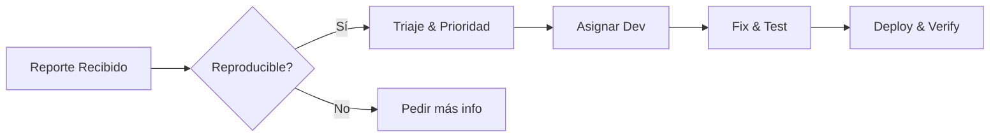

## 🐞 Bug Report

### 📌 Título

[Componente] [Error] al [acción] en [entorno]
_Ejemplo: "Login – NullPointerException al autenticar en staging"_

---

### 📋 Contexto

- **Producto/servicio:** [Nombre del sistema o microservicio]
- **Versión/commit:** [Tag, hash de commit o versión desplegada]
- **Entorno:** [prod/staging/local, SO, JVM, Docker image, configuraciones clave]
- **Cambios recientes:** [Despliegues/configuraciones desde YYYY-MM-DD]

---

### 🔄 Reproducibilidad

1. Paso 1: [acción precisa]
2. Paso 2: [input exacto]
3. Paso 3: [resultado observado]

- **Frecuencia:** [ej. 3/10 intentos; solo con X datos; solo en horario pico]

---

### ✅ Expected vs ❌ Actual

- **Expected:** [qué debería ocurrir]
- **Actual:** [qué ocurre realmente: error/log exacto, stacktrace, código de estado]

---

### 📂 Evidencia

- Logs con timestamps y correlation IDs
- Métricas (CPU, latencia, GC) antes/durante/después
- Payloads (anonimizados)
- Capturas de pantalla

---

### 📊 Impacto

- Usuarios afectados: [# o %]
- Transacciones fallidas: [# o %]
- Costo / SLA: [impacto en negocio]

---

### 💡 Hipótesis

- Sospecha en módulo X
- Posible regresión por cambio Y
- Dependencia Z involucrada

---

### 🛠️ Acciones iniciales

- **Rule out:** [qué ya se descartó: recursos, permisos, colas, etc.]
- **Próximo paso:** [ej. aislar en staging con mismos datos, habilitar debug]

---

[➡️ Ver Ejemplo](../examples/bug-report-example.md)
